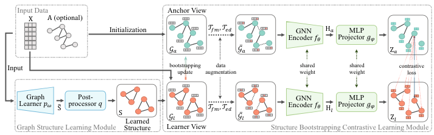
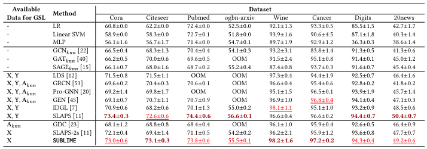
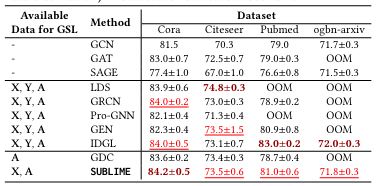
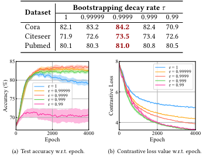

# Towards Unsupervised Deep Graph Structure Learning

## Release
[Liu et al. 2022 (April) / WWW](https://arxiv.org/pdf/2201.06367.pdf)

## In a nutshell (一言で言うと)

**Probablly important paper**: already cited by 70+ papers (as of 2023-12-04).

Authors propose **SUBLIME** (StrUcture Bootstrapping contrastive LearnIng fraMEwork).

- unsupervised graph structure learning method using contrastive learning.
- "Anchor view (providing a stable learning target)" and "Learner view (crafted: graph potential structures)" are contrasted to obtain unsupervised node representation.
  - Anchor view is basically original graph, but gradually updated by predicted adjacency matrix.

## Contents

They consider two unsupervised graph structure learning tasks:

**Structure inference**:     
making graph from zero. This is applicable to general datasets where graph structures are not predefined or unavailable.

**Structure refinement**:     
refine noisy graph to a more informative graph.

With the graph topology $S$ obtained from the model, the hypothesis is that the model performance on downstream tasks can be essentially improved with $\mathcal{G} = (S, X)$ as the input.

### Graph Learner

The options below are chosen as graph learner based on dataset characteristics:

- Attentive
- MLP
- GNN (only for graph refinement)

After this, sketched adjacency matrix $\~{S}$ is obtained.

### Post processor 

They conduct the post-processing sequentially:

- sparsification
  - for each node, it keeps the edges with top-k connection values and set the rest to 0. This is because $~{S}$ is too dense.
- activation and symmetrization
  - to handle bi-directional edges, and values should be non-negative (ReLU).
- Normalization
  - To guarantee the edge weights are within the range [0, 1].

### Contrastive learning

Skip. simple and basic.

### Structure Boostrapping Mechanism

Fixed adjacency matrix in anchor view might incur some problems: 

- inheritance of error information
- overfitting the anchor structure

So, they update the anchor structure $A_a$ with a slow-moving augmentation of the learned structure $S$ instead of keeping $A_a$ unchanged:

$$A_a \leftarrow \tau A_a + (1-\tau) S$$.

Authors mention that ``With the process of updating, the weights of some noise edges gradually decrease in $A_a$, which relieves their negative impact on structure learning.''.

### Results

**Case where $X$ is only used**

**Case where $X$ and $A$ are used**

**Ablation of boostrapping mechanism**

## My impressions

- Good paper. 
  - Ideas are clear and readability is very high.
- The result 1 is very promising.
  - If there is no graph information, it can be added.
- Maybe homophily is implicitly assumed.
  - If labels do not follow homophily, what happens?
  - (Maybe the countermeasure is GREET since the first author is the same person)
- For me, more application-oriented research theme is also OK.
